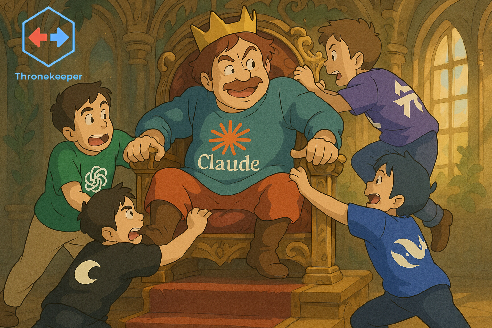

# Thronekeeper

Thronekeeper is a sophisticated fork and evolution of anthropic-proxy that provides universal AI model routing for Claude Code and other Anthropic-compatible clients. It maintains the Anthropic-style API surface while intelligently routing to OpenAI-compatible providers, with a focus on enhanced authentication, provider ergonomics, and developer experience.

> **🎉 v1.5.61 - Webview schema guardrails restored + endpoint overrides!** ✨  
> Fixes the Thronekeeper panel regression introduced by development guardrails and adds bundled endpoint override validation.

**Version 1.5.61 - Production Ready** ✅

<p align="center">
  
</p>

## Features

### 🚀 VS Code Extension
- **Modern React Webview**: Feature-rich configuration panel with real-time model loading
- **Multi-Provider Support**: Configure OpenRouter, OpenAI, Together, Deepseek, GLM, and custom providers
- **Anthropic-Native Providers**: Deepseek and GLM bypass proxy and connect directly as Anthropic-compatible endpoints
- **Secure Credential Storage**: Integration with VS Code secrets API and optional Python backend
- **Three-Model Mode**: Separate reasoning, completion, and value models for optimal performance
- **Model Management**: Search, filter, and save custom model combinations
- **Proxy Lifecycle**: Start, stop, and monitor proxy status from the extension
- **Claude Code Integration**: Automatic configuration management with workspace/global scope

### 🎯 Core Proxy Server
- **Smart Provider Detection**: Automatically detects OpenRouter, OpenAI, Together AI, and custom endpoints
- **Anthropic-Native Direct Connect**: Deepseek and GLM connect directly without the proxy
- **Intelligent API Key Resolution**: Context-aware key selection with provider-specific fallbacks
- **Model Selection Logic**: Support for separate reasoning, completion, and value models
- **Debug Endpoint**: `/v1/debug/echo` for request inspection and troubleshooting
- **Comprehensive Testing**: Full test suite covering all functionality

### 🔧 Python Backend (ct_secretsd)
- **Secure Storage**: Cross-platform keyring integration for API keys
- **Provider Adapters**: Extensible system for different AI providers
- **Encrypted Fallback**: File-based storage with encryption when keyring unavailable
- **FastAPI Service**: RESTful API for credential management and proxy control
- **Health Monitoring**: Provider status checking and validation

### 🔄 Transformer System
- **Model-Specific Adaptations**: Intelligent request/response transformations per model
- **Tool Calling Optimization**: Automatic tool_choice configuration for better tool usage
- **Reasoning Processing**: Handles chain-of-thought reasoning output from models like Deepseek R1
- **Error Tolerance**: Repairs malformed tool calls and validates schemas
- **Token Management**: Enforces max_tokens limits to prevent truncated responses
- **Pipeline Architecture**: Inspired by [claude-code-router](https://github.com/anthropics/claude-code-router), with bidirectional transformers

#### Built-in Transformers

**`tooluse`** - Tool Calling Optimizer
- Automatically sets `tool_choice: 'auto'` when tools are available
- Helps models that support tool calling but need explicit guidance
- Applied to models like `inclusionai/ring-1t` for improved MCP tool visibility

**`enhancetool`** - Error Tolerance
- Validates and adds default values for tool schemas
- Repairs malformed JSON in tool call arguments
- Provides fallback structures when tool calls are invalid
- Essential for models with inconsistent tool call formatting

**`reasoning`** - Reasoning Content Processor
- Processes `reasoning_content` and `delta.reasoning` fields
- Converts various reasoning formats to Anthropic's `thinking_delta` events
- Handles chain-of-thought output from models like Deepseek R1, Qwen QwQ
- Works in both streaming and non-streaming modes

**`maxtoken`** - Token Limit Enforcer
- Sets default `max_tokens` when not specified
- Caps token limits to prevent truncation
- Useful for models with non-standard token limits
- Example: Deepseek Reasoner uses `max_tokens: 65536`

#### Configuring Transformers

Transformers are configured per model in `models-capabilities.json`:

```json
{
  "transformers": {
    "openrouter": {
      "inclusionai/ring-1t": ["tooluse", "enhancetool"],
      "/deepseek[-_]?reasoner/i": ["reasoning", "tooluse"],
      "/.*thinking.*/i": ["reasoning"]
    },
    "deepseek": {
      "/^deepseek[-_]?reasoner/i": ["reasoning", ["maxtoken", {"max_tokens": 65536}]]
    }
  }
}
```

**Pattern Matching:**
- Exact model names: `"inclusionai/ring-1t"`
- Regex patterns: `"/deepseek[-_]?reasoner/i"`
- Wildcards: `"*"` matches all providers
- Provider-specific rules override wildcards

**Transformer Options:**
- String form: `"tooluse"` (no options)
- Tuple form: `["maxtoken", {"max_tokens": 65536}]` (with options)

#### Pipeline Execution

Transformers are applied in two stages:

1. **Request Pipeline** (before sending to provider):
   - Transformers applied in the order specified
   - Modifies request payload (tools, max_tokens, etc.)
   - Example: `tooluse` sets tool_choice, `maxtoken` enforces limits

2. **Response Pipeline** (before returning to client):
   - Transformers applied in **reverse order**
   - Modifies response content (reasoning blocks, tool calls, etc.)
   - Example: `reasoning` converts delta.reasoning to thinking_delta

**Debug Logging:**
```bash
DEBUG=1 npm start
# Logs transformer application and results
```

#### Troubleshooting with Transformers

**Problem: MCP tools not being used**
- Check if model needs `tooluse` transformer
- Verify tool definitions in request
- Enable DEBUG logging to see tool_choice being set

**Problem: Reasoning output not showing**
- Add `reasoning` transformer for your model pattern
- Check if model uses `reasoning_content` vs `delta.reasoning`
- Verify streaming vs non-streaming response handling

**Problem: Truncated responses**
- Add `maxtoken` transformer with appropriate limit
- Check provider's max token support
- Verify request includes sufficient max_tokens

**Problem: Malformed tool calls**
- Add `enhancetool` transformer
- Check tool schema definitions
- Review DEBUG logs for parsing errors

## Installation & Usage

### 🚀 VS Code Extension (Recommended)

1. **Install the extension** from the VS Code marketplace or install the `.vsix` file:
   ```bash
   code --install-extension thronekeeper-1.5.61.vsix
   ```

2. **Open the Thronekeeper panel**:
   - View → Thronekeeper (Panel)
   - Or use the Command Palette: `Thronekeeper: Open Panel`

3. **Configure your provider**:
   - Select your AI provider (OpenRouter, OpenAI, Together, Deepseek, GLM, or Custom)
   - Add your API key using the secure storage button
   - Choose your preferred models or use the recommended pairings
   - Note: Deepseek and GLM connect directly as Anthropic-native providers (no proxy needed)

4. **Start the proxy**:
   - Click "Start Your AI Throne" in the panel
   - The extension will automatically configure Claude Code if enabled

5. **Three-Model Mode** (Advanced):
   - Enable in extension settings (`claudeThrone.twoModelMode`)
   - Set separate reasoning, completion, and value models for optimal performance

### Quick Setup Examples

#### OpenRouter (Recommended)
Access 400+ models including GPT-4, Claude, Gemini, and more:
1. Select "OpenRouter" as provider
2. Get your API key from [openrouter.ai/keys](https://openrouter.ai/keys)
3. Browse models or use popular pairings
4. Start proxy - done!

#### OpenAI
Use GPT-4, GPT-4 Turbo, and o1 models:
1. Select "OpenAI" as provider
2. Add your OpenAI API key
3. Select from available GPT models
4. Start proxy

#### Custom Provider
Connect to any OpenAI-compatible endpoint:
1. Select "Custom" as provider
2. Enter your endpoint URL (e.g., `https://api.example.com/v1`)
3. Add your API key
4. Enter model IDs manually or load from endpoint
5. Start proxy

### Troubleshooting Anthropic-Compatible Custom Providers

- **Supported providers:** Anthropic-compatible APIs like Moonshot/Kimi (`https://api.moonshot.ai/anthropic/v1/messages`) and Minimax (`https://api.minimax.io/anthropic`) now load models automatically. Configure them as saved custom providers or via the generic `custom` slot.
- **Automatic models endpoint resolution:** The extension rewrites Anthropic-style bases to the correct models list URL. Example: `https://api.minimax.io/anthropic` → `https://api.minimax.io/v1/models` before fetching.
- **When a 404 appears:** Check the exact base URL and ensure it matches the provider documentation. If the upstream does not expose a models list, you can still enter model IDs manually in the panel.
- **Native Anthropic providers:** Deepseek and GLM remain native connections handled by Claude Code; they intentionally bypass remote model fetching and surface the built-in Claude model entry.

## Origins & Attribution

Thronekeeper was initially forked from [anthropic-proxy](https://github.com/maxnowack/anthropic-proxy) by [Max Nowack](https://github.com/maxnowack) — a clean, focused CLI tool for proxying Anthropic API requests to OpenRouter. We're deeply grateful for Max's foundational work, which inspired this project.

**What started as a fork has evolved into a complete rebuild:**

| Aspect | Original (`anthropic-proxy`) | Thronekeeper |
|--------|------------------------------|---------------|
| **Architecture** | Single-file CLI (~350 LOC) | Full VS Code extension ecosystem |
| **Providers** | OpenRouter only | OpenRouter, OpenAI, Together, Deepseek, GLM, custom endpoints |
| **Security** | Environment variables only | VS Code SecretStorage + optional Python keyring backend |
| **UI** | Command-line only | Modern webview panel with real-time model loading |
| **Model Support** | Single model | Three-model mode (reasoning + completion + value) |
| **Testing** | None | Comprehensive test suite |
| **Configuration** | Environment variables | Workspace/global settings, saved combinations |

While the core proxy concept remains, the architecture, scope, and implementation have diverged significantly. We've detached from the fork network to establish Thronekeeper's independent identity, but we'll always acknowledge Max's work as the inspiration that got this started.

**Original License:** MIT License  
**Original Author:** Max Nowack  
**Original Repo:** <https://github.com/maxnowack/anthropic-proxy>

Thank you, Max! 🙏

## Current Status

- **Version:** 1.5.61 (Production Ready)
- **VS Code Extension:** ✅ Fully functional with modern React webview
- **Python Backend:** ✅ Complete ct_secretsd service with secure storage
- **Core Proxy:** ✅ Enhanced with smart key resolution and debugging
- **Testing:** ✅ Comprehensive test suite
- **Documentation:** ✅ User guides and API documentation

## 🗺️ Roadmap

Thronekeeper is actively evolving with community-driven features and enhancements. The following features are planned additions to expand functionality and improve the developer experience. These are aspirational goals without specific release timelines, and we welcome feedback and contributions from the community.

### Multiple Provider Support (Per-Model)

**Description:** Enable using different providers for each model role, allowing you to mix and match providers based on your specific needs.

**Benefits:**
- Optimize for cost by using free models where appropriate
- Minimize latency by selecting geographically closer providers
- Maximize quality by choosing the best provider for each task type

**Status:** Coming Soon

### Letta API Support

**Description:** Integration with Letta (formerly MemGPT) for memory-augmented AI agents with persistent context across sessions.

**Benefits:**
- Long-term memory retention beyond context window limits
- Seamless continuation of conversations across multiple sessions
- Enhanced agent capabilities with stateful interactions

**Status:** Coming Soon

### Abacus.AI / ChatLLM Support

**Description:** Native support for Abacus.AI and ChatLLM Team endpoints, providing access to enterprise-grade models.

**Benefits:**
- Access to specialized enterprise models
- Team collaboration features and shared configurations
- Advanced model training and fine-tuning capabilities

**Status:** Coming Soon

### OAuth Authentication

**Description:** OAuth 2.0 authentication flow support for providers that require browser-based authorization.

**Supported Providers:**
- OpenAI Codex
- Google Gemini
- Alibaba Qwen Code

**Benefits:**
- Seamless authentication without manual API key management
- Automatic token refresh and session management
- Enhanced security with time-limited access tokens

**Status:** Coming Soon

### Example: Multi-Provider Configuration

Here's a preview of how multi-provider configuration might look when implemented:

```json
{
  "claudeThrone.multiProviderMode": true,
  "claudeThrone.modelProviders": {
    "reasoning": {
      "provider": "openrouter",
      "model": "deepseek/deepseek-r1"
    },
    "completion": {
      "provider": "openai",
      "model": "gpt-4o"
    },
    "value": {
      "provider": "together",
      "model": "meta-llama/llama-3.1-8b-instruct"
    }
  }
}
```

> **Note:** This configuration format is subject to change during implementation.

### Community Feedback Welcome

The roadmap is shaped by user needs and community contributions. If you have feature requests, use cases, or feedback on these planned enhancements, please open an issue on our [GitHub repository](https://github.com/KHAEntertainment/thronekeeper/issues). We're committed to building features that solve real problems for developers working with AI models.

## Configuration Reference

### VS Code Extension Settings

Key settings in `settings.json` or Settings UI:

```json
{
  "claudeThrone.proxy.port": 3000,
  "claudeThrone.proxy.debug": false,
  "claudeThrone.autoApply": true,
  "claudeThrone.twoModelMode": false,
  "claudeThrone.reasoningModel": "",
  "claudeThrone.completionModel": "",
  "claudeThrone.customEndpointKind": "auto"
}
```

### Extension Commands

Access these commands via the Command Palette (`Cmd/Ctrl + Shift + P`):

- `Thronekeeper: Open Panel` - Open the configuration panel
- `Thronekeeper: Store [Provider] API Key` - Store API keys securely
- `Thronekeeper: Start/Stop Proxy` - Control proxy lifecycle
- `Thronekeeper: Apply/Revert Base URL` - Configure Claude Code

## Model Selection Best Practices

### Understanding Model Trade-offs

**Speed vs Quality:**
- **Small models (7B-32B params)**: Fast responses, good for simple tasks
- **Medium models (70B params)**: Balanced performance and quality
- **Large models (1T+ params)**: Best quality, but slower responses

### Recommended Model Pairings

#### Speed-Focused Development
```text
Reasoning: qwen/qwen-2.5-coder-32b-instruct
Completion: qwen/qwen-2.5-coder-32b-instruct
```

#### Quality-Focused Development
```text
Reasoning: deepseek/deepseek-r1
Completion: deepseek/deepseek-r1
```

#### Balanced Three-Model Setup (Recommended)
```text
Reasoning: deepseek/deepseek-r1
Completion: qwen/qwen-2.5-coder-32b-instruct
Value: google/gemini-2.0-flash-exp:free
```

#### Budget-Friendly Setup
```text
Reasoning: google/gemini-2.0-flash-exp:free
Completion: google/gemini-2.0-flash-exp:free
```

### Provider-Specific Recommendations

**OpenRouter:**
- Best for variety - access to 400+ models
- Free tier available for many models
- Good for experimenting with different models

**OpenAI:**
- Best for reliability and support
- GPT-4 and o1 models available
- Requires paid API key

**Together AI:**
- Good open-source model selection
- Fast inference for supported models
- Competitive pricing

**Deepseek:**
- Anthropic-native API (direct connection, no proxy)
- DeepSeek R1 and other models
- Cost-effective with strong performance

**GLM (Z.AI):**
- Anthropic-native API (direct connection, no proxy)
- GLM-4.6 and other models from Zhipu AI
- Good for Chinese language tasks

## Advanced Usage

For command-line usage, environment variables, Python backend setup, and development workflows, see the [Advanced Setup Guide](docs/advanced-setup.md).

## Attribution & License

**Original Inspiration:** [anthropic-proxy](https://github.com/maxnowack/anthropic-proxy) by Max Nowack

**License:** MIT License
- Original work © 2025 Max Nowack
- Thronekeeper extensions and modifications © 2025 KHA Entertainment and contributors

See the full [Origins & Attribution](#origins--attribution) section above for details on the evolution from the original project.

Permission is hereby granted, free of charge, to any person obtaining a copy of this software and associated documentation files (the "Software"), to deal in the Software without restriction, including without limitation the rights to use, copy, modify, merge, publish, distribute, sublicense, and/or sell copies of the Software, and to permit persons to whom the Software is furnished to do so, subject to the above copyright notices and this permission notice being included in all copies or substantial portions of the Software.

THE SOFTWARE IS PROVIDED "AS IS", WITHOUT WARRANTY OF ANY KIND, EXPRESS OR IMPLIED.

## Contributions

Contributions are welcome. Please open issues and/or Pull Requests on the [GitHub repository](https://github.com/KHAEntertainment/thronekeeper).

### Contribution Guidelines

- **Do not commit VSIX files**: VSIX extension packages are build artifacts and should not be committed to git. They are automatically excluded via `.gitignore`.
- **Do not commit large binaries**: Files larger than 1MB should not be committed. The CI pipeline will reject PRs containing `.vsix` files or large binaries.

---

**Made with ❤️ for the AI development community**